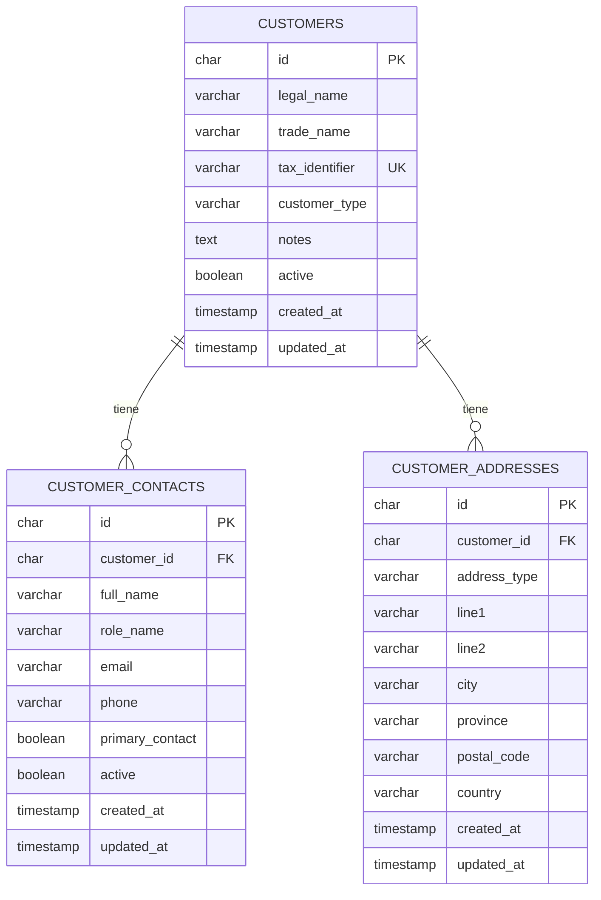

# Modelo inicial de base de datos

## Criterio

La base de datos se crea en MariaDB y se versiona con Flyway. El primer modulo persistente es clientes, con una estructura normalizada:

- `customers`: datos fiscales y comerciales del cliente.
- `customer_contacts`: personas de contacto vinculadas a un cliente.
- `customer_addresses`: direcciones separadas por tipo.

El objetivo es evitar columnas repetidas como `telefono_1`, `telefono_2`, `direccion_facturacion`, `direccion_obra`, etc. Cada dato repetible tiene su propia tabla.

## Diagrama ER

## Proximos modulos

Despues de clientes, el modelo deberia crecer en este orden:

1. Usuarios, roles y permisos.
2. Facturas y lineas de factura.
3. Cobros y vencimientos.
4. Gastos y proveedores.
5. Obras/proyectos de construccion.
6. Documentos adjuntos y auditoria.
