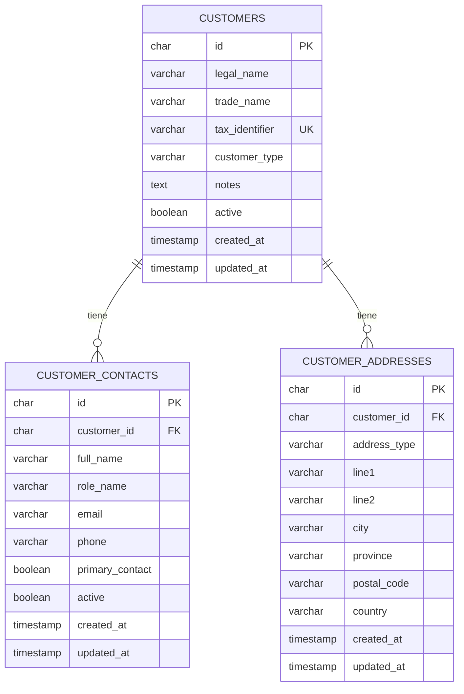

# Modelo de base de datos

## Estado

La base de datos se crea en MariaDB y se versiona con Flyway.

- `V1__create_core_schema.sql`: primer modulo persistente de clientes.
- `V2__create_domain_model.sql`: tronco completo del dominio destino para empresas, usuarios, clientes, facturacion, compras, contabilidad, fiscal, laboral, documentos, auditoria e integraciones.

El documento de referencia actualizado es `docs/domain-model.md`. El inventario del esquema original esta en `docs/legacy-schema-inventory.md`.

## Criterio de clientes

El primer modulo persistente fue clientes, con una estructura normalizada:

- `customers`: datos fiscales y comerciales del cliente.
- `customer_contacts`: personas de contacto vinculadas a un cliente.
- `customer_addresses`: direcciones separadas por tipo.

El objetivo es evitar columnas repetidas como `telefono_1`, `telefono_2`, `direccion_facturacion`, `direccion_obra`, etc. Cada dato repetible tiene su propia tabla.

## Diagrama ER

## Modelo completo

El modelo completo crece alrededor de `companies` y separa el legacy en modulos:

1. Empresas, usuarios, membresias y configuracion.
2. Clientes, contactos, direcciones, perfiles fiscales y tarifas.
3. Facturas emitidas, lineas, cobros, series, VeriFactu y SII.
4. Proveedores, compras, gastos y recurrentes.
5. Plan contable, ejercicios, asientos, inmovilizado y cierres.
6. Modelos fiscales, presentaciones, consultas AEAT y discrepancias.
7. Empleados, contratos, fichajes, trabajos, ausencias, nominas y RETA.
8. Documentos, certificados, notificaciones, auditoria, calendario y conocimiento.

Los cambios definitivos de esquema deben hacerse siempre con nuevas migraciones Flyway.
